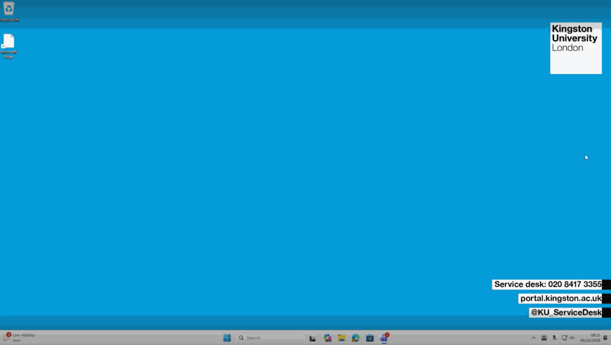
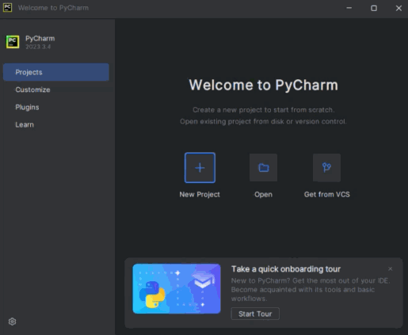
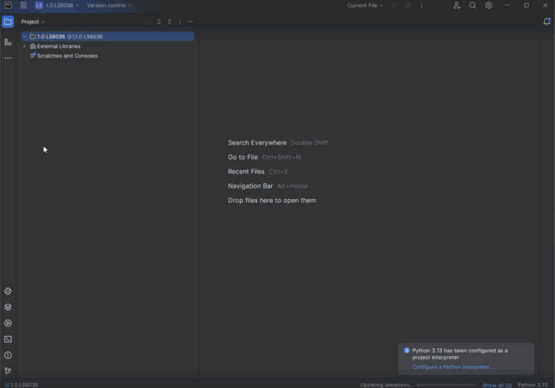
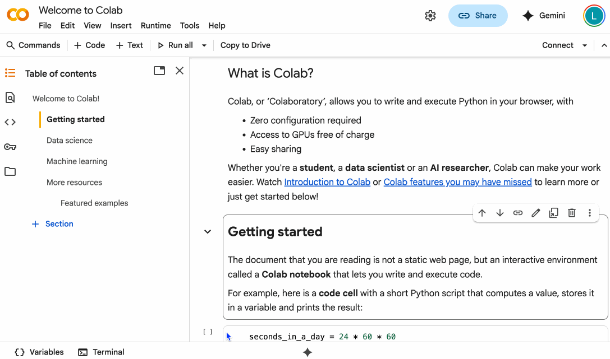

# Set up

We are going to use Python for this course. You can do this on campus from a University Computer, online using a free Google Colab account that you can access from any web browser, or by downloading Python and Visual Studio Code onto your own device. 

Click below to see the set up instructions for each:

::: {.panel-tabset group="tools-tabset"}

### University Computer 

To get set up, follow the below steps. **Click each step** for detailed instructions.

::: {.callout-note collapse="false" title="Step 1: Launch Pycharm from AppsAnywhere" icon="false"}
1.  Type in AppsAnywhere to the windows bar. This will open in a web browser
2.  Open the following applications by typing the name in and clicking launch: 
    i.  Pycharm
_This will automatically install python as well_


:::

::: {.callout-caution collapse="false" title="Step 2: Navigate to your OneDrive folder" icon="false"}
1.  Click "Open Folder" on the loading screen

2.  Scroll to the bottom to find "`O:`" - this is your OneDrive folder. You should click this, and your OneDrive folders should load. 

3.  Create a new folder for this python course, and open this folder. 


:::

::::: {.callout-caution collapse="false" title="Step 4: Create and run a Python file" icon="false"}
You're now ready to run some Python code!

1.  Right click your folder and click New Python File
2.  Give your file a name (_it should automatically add a .py - e.g. test.py_)
3.  Add the following line to your file 

```{python}
#| eval: false
print("Hello World")
```

4.  Press the run button

And that's it - you're all set up! 



::: {.callout-warning icon="false" collapse="false"}
Make sure you can find your file in file explorer. Always **back up your work** such as saving in OneDrive or emailing to yourself so that you don't lose your progress.
:::
:::::

### Online Cloud

[Google Colab](https://colab.research.google.com/#scrollTo=GJBs_flRovLc) is a **free** tool for running python on a browser - from a file saved in your Google Drive. 

:::{.callout-caution collapse="false" title="Caution" icon="true"}
You shouldn't need a paid account for this course. If your work becomes too large, then I suggest downloading and running Python and Visual Studio Code on your device. 
:::

To get set up, follow the instructions below: 

::: {.callout-note collapse="false" title="Set up Google Colab notebook" icon="false"}
1.  Sign into Google with any Google account
2.  Go to [Google Colab](https://colab.research.google.com/#scrollTo=GJBs_flRovLc)
3.  Click file -> New Notebook in Drive 
4.  Name your file (e.g "Test.ipynb") _The file is an Ipython Notebook so ends with .ipynb instead of .py_
5.  Add and run the following code: 

```{python}
#| eval: false
print("Hello World")
```


:::

And that's it for setting up with Google Colab!

### Own Device

If you're working on your own laptop or computer it's also possible to download and run Python and Visual Studio Code. These are both free, open-source programs. 

::: {.callout-note collapse="false"}
If you're working on a tablet, chromebook or your device is typically slow, I recommend looking at the Google Colab option instead
:::

Installing Python and VSCode can be a bit fiddley - let the teaching team know if you'd like any support. 

Why two programs? Python is the programming language, that takes our data and does our analyses. Visual Studio Code is a program we use to edit and run our python files. It's a text editor that is specialised for coding projects. 

::: {.callout-note collapse="false" title="Step 1: Install Python" icon="false"}

You can [Install Python from this website](https://www.python.org/downloads/). It should automatically detect whether you are on a Windows or a Mac PC and suggest which version to download. Click download and then follow the installation instructions. 


:::

::: {.callout-caution collapse="false" title="Step 2: Install Visual Studio Code" icon="false"}

Once Python is installed, you can [install Visual Studio Code from this website](https://code.visualstudio.com/). 

It should also automatically detect what type of PC you are on. 


:::

::: {.callout-tip collapse="false" title="Step 3: Create or move to a folder for LS6036" icon="false"}

1.  Click "Open Folder" on the loading screen

2.  Browse files until you can find your documents - wherever you keep your university files. 

3.  Create a new folder for this python course, and open this folder. 


:::

::::: {.callout-caution collapse="false" title="Step 4: Install the python extension" icon="false"}

Now we need to set up Visual Studio Code to recognise and use your version of python. 

1.  Click the extensions tab

2.  Search and install python


:::::


::: {.callout-note collapse="false" title="Step 5: Write and run a python file" icon="false"}
You're now ready to run some Python code!

1.  Go back to your folder 
2.  Click the "New file" button
3.  Give your file a name ending .py (e.g. "Test.py" )
4.  Add the following line to your file 

```{python}
#| eval: false
print("Hello World")
```

5.  Press the run button

And that's it - you're all set up! 


:::
